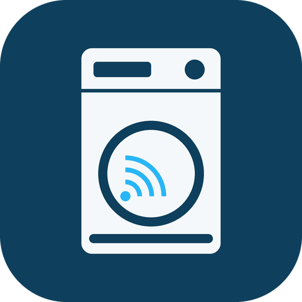

<h1 align="center">
  <br>
  electrolux2mqtt
</h1>

<p align="center">
  <b>Electrolux Group API → MQTT bridge, with Home Assistant style discovery.</b><br>
  Brings connected <b>Electrolux</b>, <b>AEG</b>, <b>Frigidaire</b> and <b>+home</b> appliances into
  <b>Jeedom</b>, <b>Home Assistant</b>, or anything else that speaks MQTT Discovery —
  in real time, without polling the cloud.
</p>

---

## Why

Electrolux appliances are cloud-only: there is no local API, and no Matter. Since late 2024 the
group runs an official developer portal, so an integration no longer has to reverse-engineer the
mobile app.

Home Assistant users have community integrations. **Jeedom has nothing** — no Electrolux plugin
exists on the market, and the *HomeConnect* plugin covers the BSH platform (Bosch, Siemens, Neff,
Gaggenau), not this one. This bridge fills that gap, and works for any MQTT-Discovery consumer.

It is built on **[`electrolux-group-developer-sdk`](https://pypi.org/project/electrolux-group-developer-sdk/)**,
the SDK published by Electrolux itself, rather than on a hand-rolled HTTP client — so it inherits
the official data model, token handling and event stream.

## Features

- **Real-time, no polling.** State changes arrive as a push over the API's **Server-Sent Events**
  livestream. A single full re-read every 15 minutes (configurable, and disableable) acts as a
  safety net — that is 96 API calls a day, whatever your appliance does.
- **Every appliance, not just one family.** Entities are derived from the **capabilities the
  appliance itself declares**, so ovens, hobs, hoods, fridges, dishwashers, washers, dryers, air
  conditioners, purifiers, dehumidifiers and robot vacuums all work, and a property Electrolux adds
  tomorrow shows up without a code change. Verified against the capability sets of 14 appliance
  families shipped with the official SDK.
- **Auto-discovery.** Entities appear on their own, grouped as one device, with proper components:
  measurements as sensors, on/off properties as switches, enumerations as selects, ranges as
  numbers, and write-only commands (`START`, `STOPRESET`, …) as buttons.
- **Sensible by default.** Temperatures are published in one unit, not twice; maintenance counters
  and algorithm internals are filtered out; end-of-cycle time is derived from the remaining
  seconds, because *20:45* beats *4380 s* on a dashboard.
- **Reconnection-proof.** Discovery, states **and command subscriptions** are replayed on *every*
  MQTT (re)connection. This is the failure mode that silently breaks a lot of home-made bridges:
  with a non-persistent session the broker drops your subscriptions on any disconnect, and a bridge
  that only subscribes at startup keeps publishing states while quietly ignoring every command.
- **Last Will.** If the container dies, the appliance's *online* indicator flips to off by itself.
- **Token-safe.** Electrolux rotates the refresh token on every renewal. The current pair is
  persisted, so a container restart does not leave you locked out with a spent token.
- **Read-only mode.** One switch to expose states and no commands at all — worth considering on an
  oven or a hob.

## About remote control

Monitoring always works. **Commands are gated by the appliance itself**: on ovens and hobs, remote
operation has to be enabled on the appliance's own display, and EU regulations make it switch
itself off again after a while. When a command is rejected, the bridge logs the reason and points
at the current `remoteControl` value, which is published as an entity of its own.

## Getting your credentials

1. Pair the appliance in the **Electrolux** (or **AEG**) mobile app, and give it a name.
2. Go to <https://developer.electrolux.one/dashboard>, sign in with the same account.
3. Create an **API key**, then generate an **access token / refresh token** pair.

`--dump` prints everything the API knows about your appliances — including the full capability
tree — which is the fastest way to see what the bridge will produce:

```sh
docker run --rm \
  -e ELECTROLUX_API_KEY=... -e ELECTROLUX_REFRESH_TOKEN=... \
  ghcr.io/ripleyxlr8/electrolux2mqtt:latest --dump
```

## Running it

### Docker

```sh
docker run -d --name electrolux2mqtt \
  -e ELECTROLUX_API_KEY=... \
  -e ELECTROLUX_REFRESH_TOKEN=... \
  -e MQTT_HOST=192.168.1.10 \
  -v /path/to/config:/config \
  ghcr.io/ripleyxlr8/electrolux2mqtt:latest
```

Mounting `/config` is not strictly required, but strongly recommended: that is where the rotating
token pair is stored.

### Unraid

The template is in [ripleyXLR8/unraid-templates](https://github.com/ripleyXLR8/unraid-templates),
and the app is listed in Community Applications.

### Configuration

Everything can be set through environment variables, or through
[`electrolux2mqtt.conf`](electrolux2mqtt.conf.template) in the mounted `/config` folder. Variables
win over the file.

| Variable | Default | What it does |
|---|---|---|
| `ELECTROLUX_API_KEY` | — | API key from the developer portal (required) |
| `ELECTROLUX_REFRESH_TOKEN` | — | Refresh token from the developer portal (required) |
| `ELECTROLUX_ACCESS_TOKEN` | — | Optional; obtained from the refresh token when absent |
| `ELECTROLUX_TOKEN_FILE` | `/config/electrolux_token.json` | Where the rotating pair is persisted |
| `ELECTROLUX_REFRESH_INTERVAL` | `900` | Seconds between safety re-reads, `0` disables |
| `ELECTROLUX_TEMPERATURE_UNIT` | `auto` | `auto`, `C` or `F` |
| `ELECTROLUX_READ_ONLY` | `false` | `true` publishes states only |
| `ELECTROLUX_EXCLUDE` / `ELECTROLUX_INCLUDE` | — | Shell-style patterns on property paths |
| `MQTT_HOST` / `MQTT_PORT` | `127.0.0.1` / `1883` | Broker |
| `MQTT_USER` / `MQTT_PASSWORD` | — | Leave empty for an anonymous broker |
| `MQTT_DISCOVERY_PREFIX` | `homeassistant` | Where discovery messages go |
| `MQTT_TOPIC_PREFIX` | `electrolux` | Root of state and command topics |
| `MQTT_CLIENT_ID` | `electrolux2mqtt` | |
| `LOG_LEVEL` | `INFO` | `DEBUG` also logs every raw event |

## Topics

```
electrolux/<appliance>/<entity>/state          state
electrolux/<appliance>/<entity>/set            command
electrolux/<appliance>/availability            online / offline
homeassistant/<component>/electrolux_<appliance>/<entity>/config   discovery (retained)
```

## Jeedom notes

- The plugin only creates equipment for topic roots listed in its **data topics** setting, so
  `electrolux` has to be there. You do not have to type it: start the plugin daemon, wait a
  minute, refresh its configuration page, and the roots it has discovered but that are not
  configured yet are offered with a `+` button. This is deliberate and
  [documented](https://mips2648.github.io/jeedom-plugins-docs/MQTTDiscovery/fr_FR/#tocAnchor-1-7-2) —
  the plugin does not auto-enable everything it finds, because that would create a lot of
  equipment nobody asked for.
- The plugin renames a command after its `device_class`. The bridge therefore drops any
  `device_class` used more than once on the same appliance, so that a double oven does not end up
  with *Porte* and *Porte (1)* instead of the real labels.
- A `number` component creates two Jeedom commands: the hidden info, and a slider action.
- Command names are only set on creation: renaming one in Jeedom is permanent, and a
  re-publication will not overwrite it.

## Home Assistant notes

If you already run Home Assistant, its community integrations do this natively and you probably do
not need this bridge. It is useful when your controller is Jeedom, openHAB, Node-RED, or anything
else on MQTT.

## Tests

`python tests/test_mapping.py` checks the capability-to-entity mapping against a synthetic steam
oven — no broker, no credentials, no network.

## License

MIT. Not affiliated with, endorsed by, or supported by Electrolux Group.
